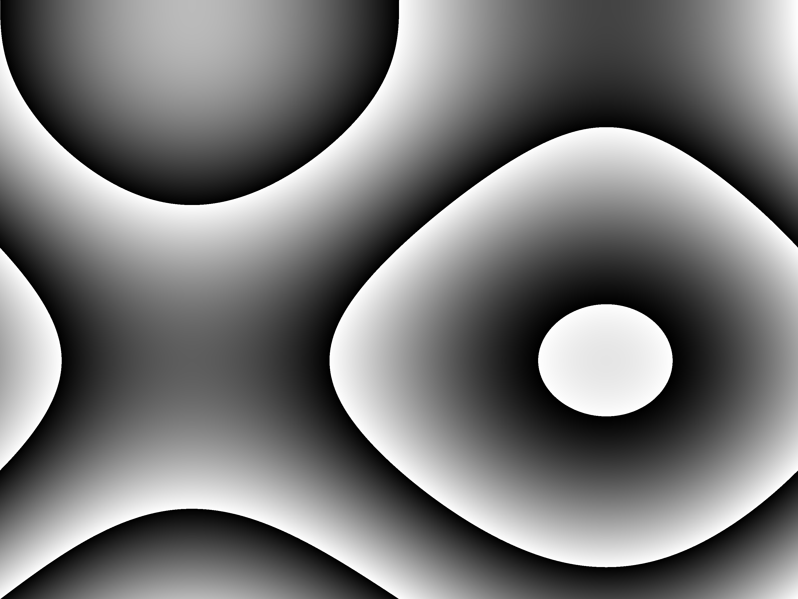
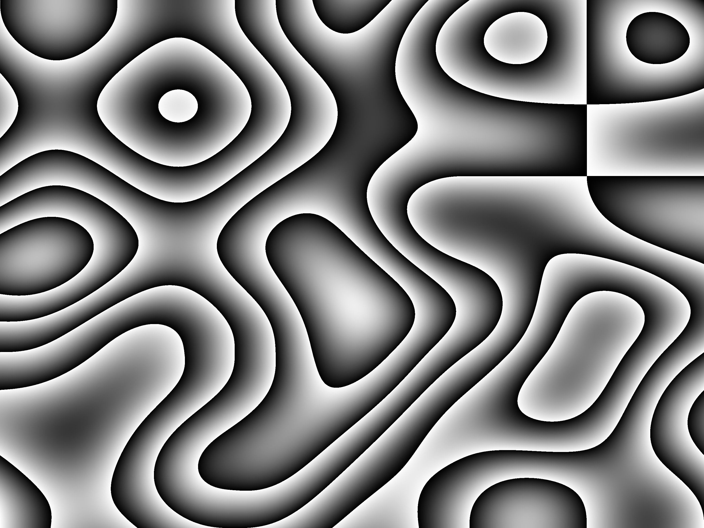

# Perlin Noise Imager

## This is a small program to create fancy images with the Perlin Noise funktion.

It is a commandline interface around sol-prog's [Perlin Noise implementation in c++](https://github.com/sol-prog/Perlin_Noise). For more informations visit this [Website](http://solarianprogrammer.com/2012/07/18/perlin-noise-cpp-11/).

Just download the binaries or build it yourself and open the resulting `.ppm` file for example with [GIMP](https://www.gimp.org/). 

## Commandline Inputs

Use `pn_image` for Linux and `pn_image.exe` for Windows. 

    $ ./pn_image -h

    Options:
    -h | --help             Print this help
    -v | --version          Print version
    -o | --output           Change Filename (default: perlin_noise)
    -f | --factor           Multiply image resolution by factor (default: 5)
    -w | --width            Image width in pixel (default: 600)
    -h | --height           Image height in pixel (default: 450)
    -z | --zoom             Zoom in / Zoom out of perlin noise picture [float] (default: 1)
    -c | --contour          Factor for altitude of perlin noise (default: 10)
    -s | --seed             Seed for perlin noise randomness [float] (default: 0)
    -n | --normalize        Toggle perlin noise normalization (default: 1)
    -r | --red              Red value [0,...,255] (default: 255)
    -g | --green            Green value [0,...,255] (default: 255)
    -b | --blue             Blue value [0,...,255] (default: 255)

# Default

    ./pn_image

# Zoom out

    ./pn_image -z 3

# Change color

    ./pn_image -r 50 -b 120 -g 170

# Disable Perlin Noise value normalizing with color

    ./pn_image -n -r 50 -b 120 -g 170

# Change Perlin Noise random seed

    ./pn_image -s 2

# Add more "altitude"

    ./pn_image -c 20

# Everything together

    ./pn_image -z 3 -n -r 50 -b 120 -g 170 -s 2 -c 20

